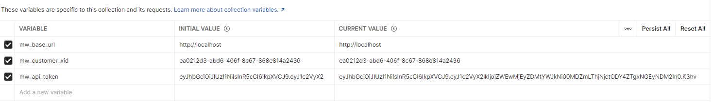

# How to run the project
Before run this project make sure `docker`, `docker-compose`, `Docker Desktop` already installed on your device.
You can download Docker Desktop from here https://www.docker.com/products/docker-desktop/

```
make run                run mini wallet service using docker
make stop               stop mini wallet service on docker
make clean              clean docker image container and volume (this will erase all data in db)

You can call this service using the postman collection given on this repo `Julo-Mini-Wallet.postman_collection.json` or you can also run this using the Mini Wallet Exercise Postman Collection Given from Julo team [here](https://documenter.getpostman.com/view/8411283/SVfMSqA3?version=latest)

Please make sure to set the env variable properly if you run using the Mini Wallet Exercise Postman Collection Given from Julo team.
